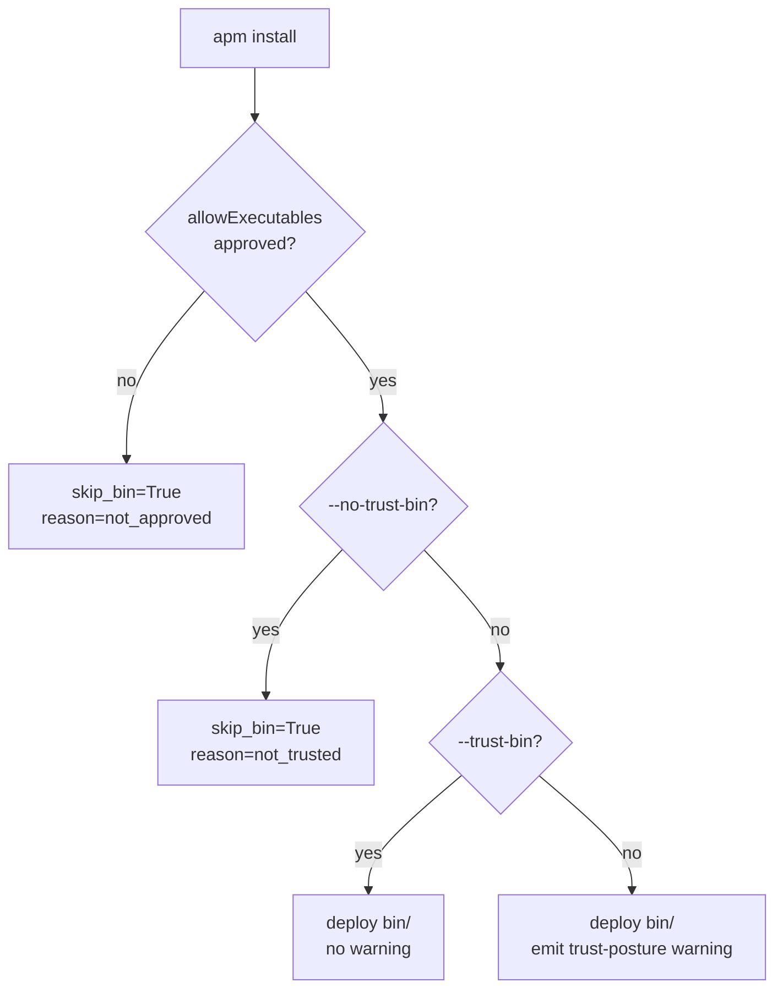

# feat(install): add --trust-bin / --no-trust-bin for plugin bin/ consent

## TL;DR

Adds a tri-state, per-invocation consent control for deploying marketplace-plugin
`bin/` executables during `apm install`. Users can now explicitly approve (`--trust-bin`),
deny (`--no-trust-bin`), or receive a trust-posture warning (default) when a plugin
deploys executables to Claude Code's PATH. This supersedes #2045 (rebased onto current
main; conflicts resolved; Copilot inline issues folded).

> [!NOTE]
> Supersedes #2045 and closes #1620. Original authorship by @sergio-sisternes-epam
> is preserved via commit trailer. Please raise concerns on this PR if the changes
> diverge from your intent.

## Problem (WHY)

- [x] Issue #1620 (deferred from PR #1591) identified that `apm install` deploys
  `bin/` executables to Claude Code's PATH without any per-invocation consent
  mechanism, giving users no way to override the policy gate for a single run.
- [x] The default behavior silently deploys executables with no user-visible signal,
  creating a trust-posture gap for operators who want explicit acknowledgment.
- [!] The Copilot inline review on PR #2045 identified a duplicate `[!]` prefix
  in the trust-posture warning message (logger already renders the symbol via
  `symbol="warning"`), and a docstring that misrepresented the gate-evaluation order.

Why these matter: the `allowExecutables` gate controls policy; this flag adds the
missing user-consent layer that the apm-review-panel recommended in #1591. Fixes
`src/apm_cli/integration/skill_integrator.py` line 1557 (Copilot signal, LEGIT) and
`src/apm_cli/install/services.py` line 248 (Copilot signal, LEGIT).

## Approach (WHAT)

| # | Fix |
|---|-----|
| 1 | Add `--trust-bin/--no-trust-bin` Click option to `apm install`; store on `InstallContext.trust_bin` |
| 2 | Extract `_resolve_bin_skip(bin_approved, trust_bin)` to combine the two independent gates deterministically (allowExecutables checked first) |
| 3 | Emit trust-posture warning in `_deploy_plugin_bin` when `trust_bin is None` (no explicit flag) |
| 4 | Remove duplicate `[!]` prefix from the warning message (symbol="warning" already renders it) |
| 5 | Fix docstring: "not_trusted is returned only when allowExecutables would otherwise permit deployment" |
| 6 | Add `not_trusted` case to `log_bin_status` for post-install summary |

## Implementation (HOW)

- **`src/apm_cli/commands/install.py`** -- Added `--trust-bin/--no-trust-bin` Click option
  and `trust_bin: bool | None` field on `InstallContext`; threads `trust_bin` into the
  `InstallContext` constructor (HEAD's transaction-guarded block preserved).
- **`src/apm_cli/install/services.py`** -- Added `_resolve_bin_skip()` helper that
  combines the `allowExecutables` gate with `trust_bin`; fixed docstring to accurately
  describe gate-evaluation order; both `_warn_target_reconcile_failure` (from main) and
  `_resolve_bin_skip` (from PR) are present.
- **`src/apm_cli/integration/skill_integrator.py`** -- Added `trust_bin` and
  `bin_skip_reason_override` params; emits trust-posture warning when `trust_bin is None`;
  removed duplicate `[!]` prefix (addresses Copilot inline on line 1557).
- **`src/apm_cli/install/exec_gate.py`** -- Added `not_trusted` case in `log_bin_status`.
- **`src/apm_cli/install/template.py`** -- Passes `trust_bin` from context to
  `integrate_package_primitives`.
- **`tests/integration/test_plugin_bin_trust_posture.py`** -- 10 integration tests
  covering all three trust-bin modes, `_resolve_bin_skip` matrix, and `log_bin_status`.
- **`docs/`** and **`packages/apm-guide/`** -- Updated policy-schema.md, repo-shapes.md,
  commands.md, governance.md to document the new consent flags.

## Diagrams

Legend: Gate evaluation order for bin/ deployment in apm install.



## Trade-offs

- **Flag is per-invocation, not persisted.** Chose not to persist `trust_bin` to
  `apm.yml`; this mirrors how `--force` works and avoids a policy-override footgun
  in CI environments.
- **`allowExecutables` takes precedence over `--trust-bin`.** This is intentional:
  project policy is authoritative; the user cannot override a project-level block
  with `--trust-bin`.
- **Default warns rather than blocks.** Maintains backward compatibility with
  existing scripts that do not pass the flag.

## Benefits

1. Users can suppress the trust-posture warning for a single run with `--trust-bin`
   without changing their project policy.
2. Users can block bin/ deployment for a single run with `--no-trust-bin` without
   editing `apm.yml`.
3. The warning surfaces the trust decision at install time, satisfying the
   apm-review-panel recommendation from #1591.
4. Two Copilot inline issues from the original PR #2045 are folded in.

## Validation

ruff check and ruff format both silent on all changed files.

Lint evidence:
```
ruff check src/apm_cli/commands/install.py src/apm_cli/install/services.py \
  src/apm_cli/integration/skill_integrator.py src/apm_cli/install/exec_gate.py \
  src/apm_cli/install/template.py tests/integration/test_plugin_bin_trust_posture.py
All checks passed!
```

### Scenario Evidence

| # | Scenario (user promise) | Principle(s) | Test(s) proving it | Type |
|---|------------------------|--------------|--------------------|------|
| 1 | `--trust-bin` deploys bin/ without warning | Secure by default | `tests/integration/test_plugin_bin_trust_posture.py::test_trust_bin_suppresses_warning` | integration |
| 2 | `--no-trust-bin` skips bin/ when policy allows | Governed by policy | `tests/integration/test_plugin_bin_trust_posture.py::test_no_trust_bin_skips_deploy` | integration |
| 3 | Default (no flag) deploys bin/ with warning | Secure by default | `tests/integration/test_plugin_bin_trust_posture.py::test_default_deploys_with_warning` | integration |
| 4 | `allowExecutables` block takes precedence over `--trust-bin` | Governed by policy | `tests/integration/test_plugin_bin_trust_posture.py::test_policy_blocks_despite_trust_bin` | integration |

## How to test

- [ ] `apm install <plugin-with-bin>` -- observe trust-posture warning in output.
- [ ] `apm install --trust-bin <plugin-with-bin>` -- no warning; bin/ is deployed.
- [ ] `apm install --no-trust-bin <plugin-with-bin>` -- bin/ skipped; post-install
  summary shows `bin/ executables skipped (--no-trust-bin)`.
- [ ] `apm install --trust-bin <plugin-with-bin>` when `allowExecutables` blocks --
  bin/ is still skipped with `not_approved` reason.

Supersedes #2045
Closes #1620

Co-authored-by: sergio-sisternes-epam <sergio-sisternes-epam@users.noreply.github.com>
Co-authored-by: Copilot <223556219+Copilot@users.noreply.github.com>
